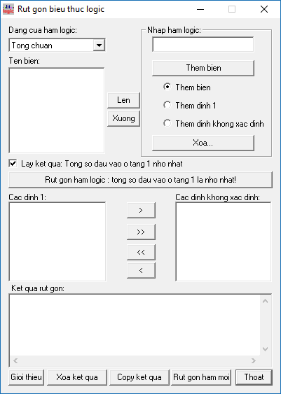

### Rút gọn biểu thức logic (Reduce logic expressions)

The GUI is using Vietnamese without accents  

To-do list
 - [ ] Convert to newer C++ version
 - [ ] Use English language in UI
 - [ ] Add new feature to allow reducing expressions in form of *x + y.not(x)*
 
